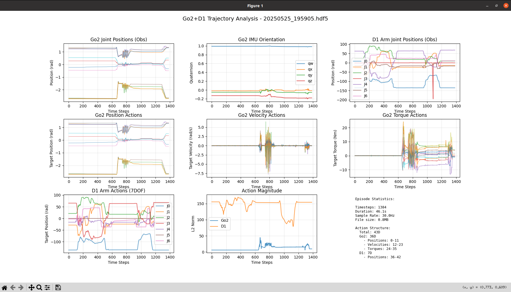

# MobiGen

> ⚠ **Note:** Ensure a **wide and unobstructed** space is available when running your robots, and be **ready to stop** promptly if needed.

## 1. Playback

### 1.1 Demo

- **Grasp Block**


- **Move to Target**


- **Grasp and Move**


- **Put the Marker in the Pen Holder**


### 1.2. Launch the playback

```bash
python playback.py <path to hdf5 file> --interface <network interface>
```

### 1.3. Control

- **To start:** Press Enter when prompted

- **To stop:** Press Ctrl+C during replay

- **To exit:** Wait for replay to finish or press Enter after it's done

## 2. Data Collection

### 2.1. Configure Parameters

Edit `config.py` to match your setup.

Make sure all connected devices (D1 arm, cameras) are publishing to the correct ZMQ ports.

### 2.2. Launch the Recorder

```bash
python data_collect.py
```

### 2.3. Control

- **Start Recording**
   Press `Enter` to begin a new data recording.
- **Stop Recording**
  - Press `Enter` again to **save** the recording to an HDF5 file
  - Type `d` or `discard` then press `Enter` to **discard** the recording

The data will be automatically synchronized to a fixed frequency (e.g. 60Hz) and saved in HDF5 format.

## 3. HDF5 File

### 3.1. HDF5 File Structure

```
YYYYMMDD_HHMMSS.hdf5
    Attributes
        sim: False
        compress: False  
        robot_type: 'go2_d1_system'
        num_episodes: 1
        episode_length: N (timesteps)
        dt: 0.02 (time interval, seconds)
        total_time: X.X (total duration, seconds)
        sync_sample_rate: XX (sync sampling rate, Hz)
        recorded_at: '2024-XX-XXTXX:XX:XX'
        total_action_dim: 43 (total action dimensions)
        go2_action_dim: 36 (Go2 action dimensions)
        d1_action_dim: 7 (D1 action dimensions)
        go2_obs_dim: 54 (Go2 observation dimensions)
        d1_obs_dim: 7 (D1 observation dimensions)

    action [N × 43]
        [0:12]      # Go2 joint target positions (rad)
        [12:24]     # Go2 joint target velocities (rad/s)  
        [24:36]     # Go2 joint target torques (Nm)
        [36:43]     # D1 arm joint positions (rad)

    observations/
        base/
            joint_positions [N × 12]     # joint positions (rad)
            joint_velocities [N × 12]    # joint velocities (rad/s)
            joint_torques [N × 12]       # joint torques (Nm)
            orientation [N × 4]          # IMU quaternion (qw,qx,qy,qz)
            angular_velocity [N × 3]     # IMU angular velocity (rad/s)
            linear_acceleration [N × 3]  # IMU linear acceleration (m/s²)

        arm/
            joint_positions [N × 7]      # arm joint positions (rad)

        images/
            front_image [N × H(480) × W(640) × 3]  # front camera (RGB)
            wrist_image [N × H(480) × W(640) × 3]  # wrist camera (RGB)
```

### 3.2. HDF5 File Validator

Please run the following command to validate your hdf5 file

```bash
python hdf5_validator.py <path to hdf5 file>
```



## 4. Train ACT

**Coming soon...**